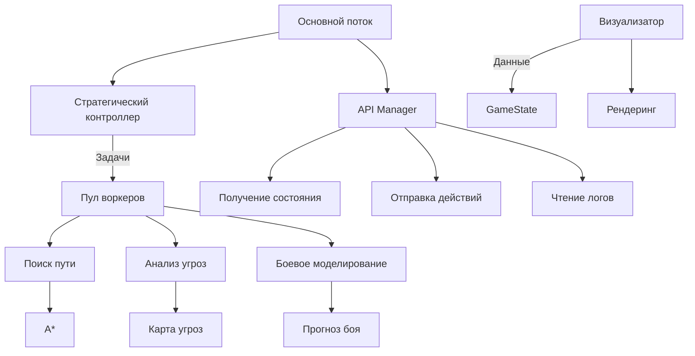

### **Обновлённая спецификация для разработки бота (v2)**

---

### **1. Система координат и карта**
- **Система**: Axial (q, r) - стандарт для логики бота
- **Хранение карты**: 
  - `ConcurrentDictionary` с ключом `(q, r)` для потокобезопасности
  - Данные гекса: `{"type": str, "cost": int, "food": FoodData | None}`
- **Типы гексов**:
  | Тип       | Стоимость ОП | Эффект                     |
  |-----------|-------------|----------------------------|
  | Пустой    | 1           | Нет                        |
  | Грязь     | 2           | Нет                        |
  | Камень    | ∞           | Непроходим                 |
  | Кислота   | 1           | -20 HP/ход                 |
  | Муравейник| 1           | Бонус атаки, автоатака     |

---

### **2. Юниты (актуальные значения)**
| Тип        | ОП | Грузопод. | Обзор | HP  | Атака |
|------------|----|----------|-------|-----|-------|
| Рабочий    | 5  | 8        | 1     | 130 | 30    |
| Солдат     | 4  | 2        | 1     | 180 | 70    |
| Разведчик  | 7  | 2        | 4     | 80  | 20    |

**Логика:**
- **Создание**: Рандомно в основном гексе муравейника (если нет юнита такого типа)
- **Обзор**: Только текущая видимость (без истории)
- **Действия за ход**: 
  ```mermaid
  graph TD
    A[Начало] --> B{Ресурс?}
    B -->|Да| C[Доставка]
    B -->|Нет| D{Рядом враг?}
    D -->|Да| E[Атака]
    D -->|Нет| F{Рядом база?}
    F -->|Да| G[Грабёж]
    F -->|Нет| H[Поиск ресурсов]
  ```

---

### **3. Ресурсы**
| Ресурс    | Калорийность | Расположение      |
|-----------|--------------|-------------------|
| Нектар    | 60           | Муравейники      |
| Хлеб      | 20           | Карта            |
| Яблоко    | 10           | Карта            |

**Механика сбора:**
- Рабочие: Приоритет на хлеб/яблоки
- Разведчики: Обнаружение нектара в чужих базах
- Солдаты: Защита при транспортировке

---

### **4. Архитектура мультиядерной системы**


**Компоненты:**
1. **API Manager**: Асинхронные HTTP-запросы (aiohttp)
2. **Стратегический контроллер**: Распределяет задачи по пулам
3. **Пул воркеров**: Concurrent.futures ThreadPoolExecutor
4. **Изолированные модули**:
   - Pathfinder: A* с приоритетной очередью
   - DangerAnalyzer: Тепловая карта угроз
   - CombatSim: Монте-Карло для боевых сценариев

---

### **5. Алгоритмы ядра (оптимизированные)**

#### **A. Параллельный A* (Python)**
```python
from concurrent.futures import ThreadPoolExecutor

def parallel_astar(units, game_state):
    with ThreadPoolExecutor() as executor:
        futures = {executor.submit(a_star, unit, game_state): unit for unit in units}
        return {futures[future]: future.result() for future in as_completed(futures)}

def a_star(unit, game_state):
    # Реализация с бинарной кучей и кешем расстояний
    # Использует axial-расстояния: max(|dq|, |dr|, |dq+dr|)
```

#### **B. Оценка угроз (векторизованная)**
```python
import numpy as np

def threat_map(game_state):
    threat = np.zeros(map_shape)
    # Векторизованный расчет расстояний до врагов
    for enemy in game_state.enemies:
        dist = axial_distance_grid(enemy.q, enemy.r)
        threat += enemy.attack / (dist + 1) * THREAT_WEIGHT
        
    # Статичные угрозы (кислота, базы)
    threat[acid_hexes] += ACID_THREAT
    threat[enemy_bases] += BASE_THREAT
    
    return threat
```

#### **C. Система принятия решений**
```python
def assign_roles(ants):
    workers = [a for a in ants if a.type == "worker"]
    soldiers = [a for a in ants if a.type == "soldier"]
    scouts = [a for a in ants if a.type == "scout"]
    
    # Балансировка по ID для равномерного распределения
    return {
        "collectors": workers[:len(workers)//2],
        "transporters": workers[len(workers)//2:],
        "defenders": soldiers[:len(soldiers)//3],
        "raiders": soldiers[len(soldiers)//3:],
        "explorers": scouts
    }
```

---

### **6. Критические оптимизации**
1. **Потокобезопасные структуры**:
   - `threading.Lock` для GameState
   - `Queue` для межпоточного взаимодействия
2. **Приоритеты путей**:
   - Транспорты: безопасные маршруты
   - Рейдеры: кратчайшие пути к базам
   - Разведчики: граница неизвестного
3. **Лимит вычислений**:
   - Таймауты для сложных алгоритмов (max 100 мс/юнит)
   - Fallback на жадные алгоритмы при таймауте

---

### **7. Распределение по ядрам**
```python
import multiprocessing as mp

def run_parallel():
    ctx = mp.get_context("spawn")
    with mp.Pool(processes=mp.cpu_count()-1) as pool:
        tasks = [
            pool.apply_async(pathfinding, (units_chunk, state)),
            pool.apply_async(threat_analysis, (state,)),
            pool.apply_async(combat_sim, (battle_scenarios,))
        ]
        results = [t.get(timeout=0.1) for t in tasks]
```

---

### **8. Визуализация в отдельном процессе**
```python
def visual_process(queue):
    import matplotlib.pyplot as plt
    while True:
        state = queue.get()
        render_hex_map(state)
        plt.pause(0.01)

if __name__ == "__main__":
    vis_queue = mp.Queue()
    vis_proc = mp.Process(target=visual_process, args=(vis_queue,))
    vis_proc.start()
    # Основной цикл отправляет данные в очередь
```

---

### **9. Технический стек**
- **Язык**: Python 3.12
- **Библиотеки**:
  - `aiohttp` для асинхронных запросов
  - `numpy` для векторных вычислений
  - `concurrent.futures` для пула потоков
  - `multiprocessing` для вытесняющей многозадачности
- **Оптимизации**:
  - Cython для критических секций A*
  - Пул соединений HTTP
  - Предварительное вычисление хешей состояний

---

### **10. Обработка краевых случаев**
1. **Блокировка муравейника**:
   - Автоматический вызов "чистильщиков" (солдаты разрушают блокировки)
2. **Критический HP**:
   - Автоотступление в безопасную зону
   - Использование ресурсов для лечения
3. **Атака роем**:
   ```python
   def swarm_attack(target, attackers):
       paths = []
       for i, ant in enumerate(attackers):
           # Распределение по окружению цели
           angle = i * (360 / len(attackers))
           hex = axial_neighbor(target, angle)
           paths.append(a_star(ant, hex))
       return paths
   ```

api получить сведения о мире тип запроса get
{"ants": [
    {
      "food": {
        "amount": 0,
        "type": 0
      },
      "health": 100,
      "id": "11111111-2222-3333-4444-555555555555",
      "lastAttack": {
        "q": 10,
        "r": 20
      },
      "lastEnemyAnt": "string",
      "lastMove": [
        {
          "q": 10,
          "r": 20
        }
      ],
      "move": [
        {
          "q": 10,
          "r": 20
        }
      ],
      "q": 10,
      "r": 20,
      "type": 0
    }
  ],
  "enemies": [
    {
      "attack": 0,
      "food": {
        "amount": 0,
        "type": 0
      },
      "health": 0,
      "q": 10,
      "r": 20,
      "type": 1
    }
  ],
  "food": [
    {
      "amount": 0,
      "q": 10,
      "r": 20,
      "type": 0
    }
  ],
  "home": [
    {
      "q": 10,
      "r": 20
    }
  ],
  "map": [
    {
      "cost": 1,
      "q": 10,
      "r": 20,
      "type": 0
    }
  ],
  "nextTurnIn": 0,
  "score": 0,
  "spot": {
    "q": 10,
    "r": 20
  },
  "turnNo": 0
}