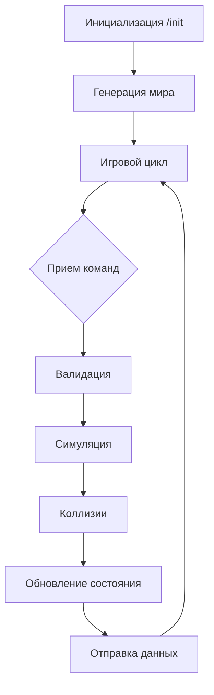

### Алгоритм работы сервера
1. **Инициализация**:
   - Прием конфигурации
   - Генерация мира:
     ```python
     def generate_world():
         create_obstacles()  # 0-30% поля
         spawn_resources()    # 0-1000 единиц
         spawn_npcs()         # 0-1000 NPC
         spawn_agent()        # 1 агент
     ```

2. **Игровой цикл**:
   ```python
   while game_running:
       # Фаза 1: Прием команд
       process_client_commands()
       
       # Фаза 2: Симуляция
       move_npcs()           # Автономное движение
       handle_collisions()    # Обработка столкновений
       update_scores()        # Начисление очков
       
       # Фаза 3: Отправка состояния
       send_visible_entities()
       
       sleep(tick_interval)
   ```

3. **Обработка коллизий**:
   ```python
   def handle_collisions():
       if agent.position in resources:
           collect_resource(agent.position)
           
       if agent.position in obstacles:
           respawn_agent()
   ```

4. **Визуализация для бота**:
   ```python
   def get_visible_entities():
       return {
           "npcs": filter_in_radius(agent.position, npcs),
           "resources": filter_in_radius(agent.position, resources),
           "obstacles": filter_in_radius(agent.position, obstacles)
       }
   ```

---

### Требования к производительности
1. Оптимизация для больших полей (1000x1000):
   - Пространственное индексирование сущностей
   - QuadTree для поиска в радиусе обзора
2. Потокобезопасность:
   - Блокировки ресурсов при обработке команд
   - Асинхронная обработка тиков

