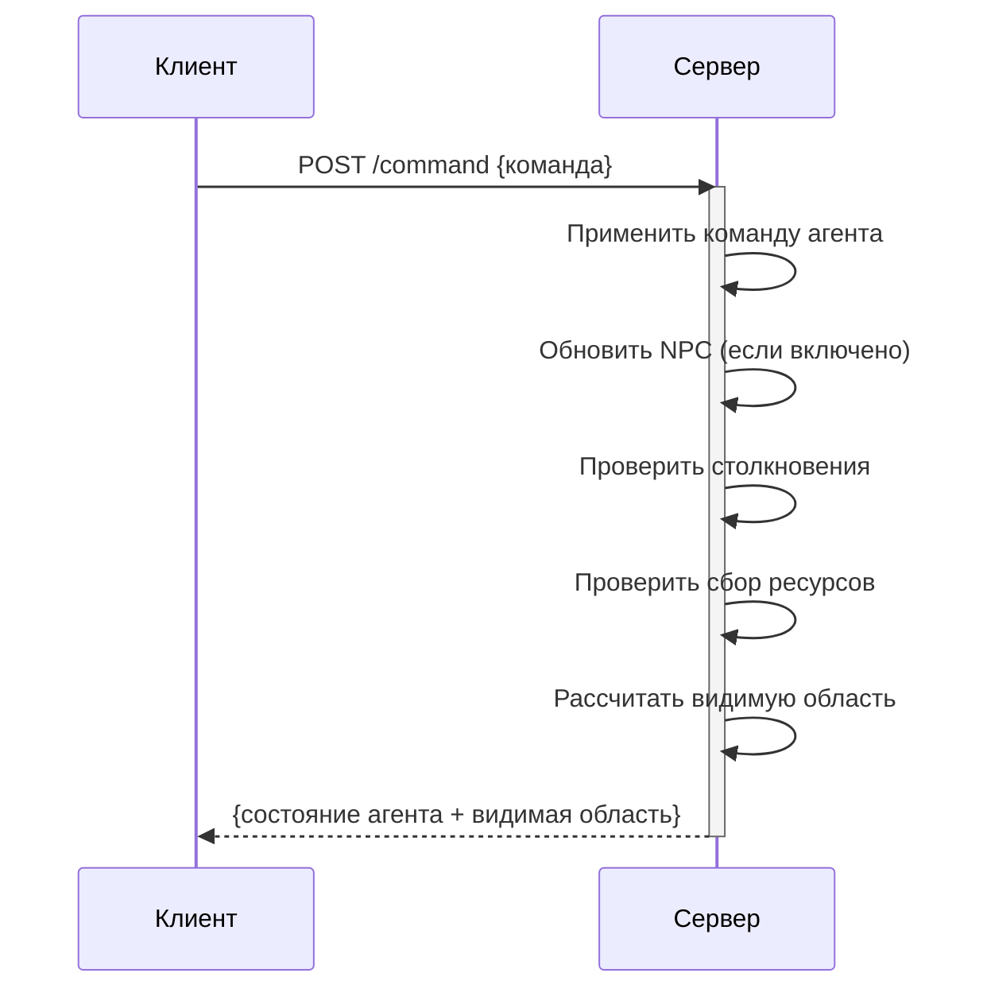

### Спецификация сервера для симуляции игры

#### Основные параметры
1. **Игровое поле**:
   - Размер: от 10x10 до 1000x1000 клеток
   - Фиксируется при инициализации сервера
   - Координаты: (0, 0) в левом верхнем углу

#### Сущности мира
| Тип         | Кол-во          | Свойства                     | Поведение                  |
|-------------|-----------------|------------------------------|----------------------------|
| **Агент**   | 1               | Позиция, радиус обзора(5-1000), направление | Управляется клиентом       |
| **NPC**     | 0-1000 (≤10% поля) | Позиция                 | Автономное/хаотичное движение |
| **Ресурсы** | 0-1000 (≤10% поля) | Позиция                      | Исчезают после сбора       |
| **Препятствия** | 0-30% поля   | Позиция                      | Статичны, блокируют движение |

---

#### Механики взаимодействия
1. **Перемещение**:
   - Разрешено только на свободные клетки (без препятствий и NPC)
   - Ресурсы **не** блокируют движение

2. **Атака**:
   - Агент может атаковать NPC в соседней клетке
   - NPC уничтожается одним попаданием

3. **Поведение NPC**:
   - Движение активируется параметром `npc_movement`
   - При движении: случайный выбор свободной соседней клетки

4. **Сбор ресурсов**:
   - Автоматически при нахождении агента в клетке с ресурсом
   - Ресурс исчезает, игроку начисляются очки

5. **Столкновение**:
   - При столкновении с препятствием или NPC агент мгновенно респавнится
   - Новое местоположение выбирается случайным образом

6. **Система очков**:
   - +5 за сбор ресурса
   - +10 за убийство NPC
   - -10 за респавн после столкновения

---

### API Endpoints

#### 1. Инициализация игры
**Endpoint**: `POST /init`  
**Тело запроса**:
```json
{
  "field_size": 50,
  "seed": 12345,
  "npc_count": 100,
  "resource_count": 200,
  "obstacle_percent": 15,
  "npc_movement": true,
  "agent_vision_radius": 5
}
```
**Ответ**: `HTTP 200 OK`
```json
{
  "status": "game_initialized",
  "parameters": {
    "field_size": 50,
    "seed": 12345,
    "npc_count": 100,
    "resource_count": 200,
    "obstacle_percent": 15,
    "npc_movement": true,
    "agent_vision_radius": 5
  }
}
```
**Ошибки**:
| Код | Тело ответа | Условие |
|-----|-------------|---------|
| `400` | `{"error": "invalid_params", "details": "field_size must be 10-1000"}` | Невалидные параметры |
| `409` | `{"error": "conflict", "message": "Game already initialized"}` | Игра уже запущена |
| `500` | `{"error": "initialization_failed", "reason": "Map generation error"}` | Ошибка генерации мира |

---

#### 2. Отправка команд
**Endpoint**: `POST /command`  
**Тело запроса**:
```json
{
  "command": "move",
  "direction": "left"
}
```
**Логика обработки**:
1. Применить команду агента
2. Обновить состояние мира (NPC, ресурсы)
3. Проверить столкновения и сбор ресурсов
4. Вернуть новое состояние

**Ответ**: `HTTP 200 OK` - успешное выполнение такта 
```json
{
  "width": 50,
  "height": 50,
  "score": 500,
  "respawns": 3,
  "agent": {"x": 10, "y": 5, "direction": "north"},
  "visible_entities": {
    "npcs": [{"x": 12, "y": 5}],
    "resources": [{"x": 8, "y": 5}],
    "obstacles": [{"x": 5, "y": 5}]
  }
}
```
**Ошибки**:
| Код | Тело ответа | Условие |
|-----|-------------|---------|
| `400` | `{"error": "invalid_command", "valid_commands": ["move", "attack"]}` | Неподдерживаемая команда |
| `400` | `{"error": "invalid_direction", "valid_directions": ["up","down","left","right"]}` | Неверное направление |
| `403` | `{"error": "forbidden", "reason": "Command not allowed during respawn"}` | Действие заблокировано |
| `404` | `{"error": "game_not_initialized", "solution": "Call POST /init first"}` | Игра не инициализирована |
| `409` | `{"error": "invalid_state", "reason": "Agent is colliding with obstacle"}` | Конфликт состояния |
| `500` | `{"error": "processing_failed"}` | Ошибка обработки |

---

#### 3. Получение полного состояния (админ)
**Endpoint**: `GET /full-state`  
**Ответ**: `HTTP 200 OK`
```json
{
  "width": 50,
  "height": 50,
  "score": 500,
  "respawns": 3,
  "agent": {"x": 10, "y": 5, "direction": "north"},
  "npcs": [{"x": 15, "y": 20}, ...],
  "resources": [{"x": 7, "y": 3}, ...],
  "obstacles": [{"x": 5, "y": 5}, ...]
}
```
**Ошибки**:
| Код | Тело ответа | Условие |
|-----|-------------|---------|
| `404` | `{"error": "game_not_found", "message": "Game state not initialized"}` | Игра не запущена |
| `500` | `{"error": "state_retrieval_failed"}` | Ошибка получения состояния |
---

#### 4. Статус сервера
**Endpoint**: `GET /status`  
**Ответ**: `HTTP 200 OK` - всегда
```json
{
  "status": "launched",
  "parameters": {
    "field_size": 50,
    "seed": 12345,
    "npc_count": 100,
    "resource_count": 200,
    "obstacle_percent": 15,
    "npc_movement": true,
    "agent_vision_radius": 5
  }
}
```
```json
{
  "status": "not initialized",
}
```
---

### Логика игрового такта


---
