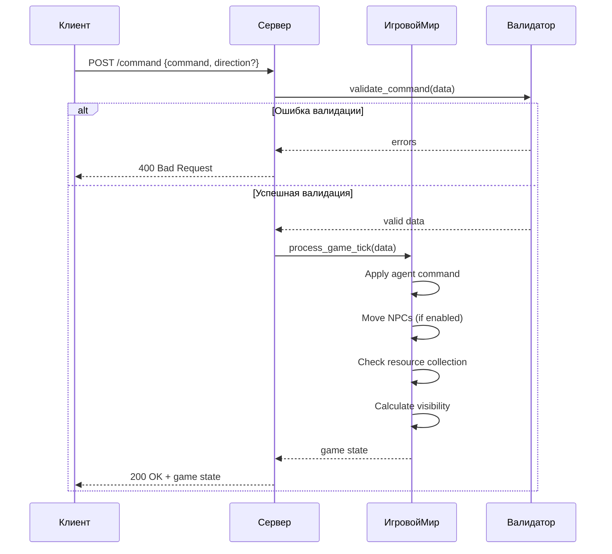

# Обновленная Спецификация Сервера для Игровой Симуляции

## Обзор Системы
Сервер реализует пошаговую игру на сетке с управляемым агентом, NPC, ресурсами и препятствиями. Каждый запрос `/command` обрабатывает один игровой такт.

---

## Основные Параметры Мира

### Игровое Поле
| Параметр       | Диапазон      | Описание                          |
|----------------|---------------|-----------------------------------|
| Размер поля    | 10x10 - 1000x1000 | Квадратное поле (N x N клеток) |
| Координаты     | (0,0) - (N-1,N-1) | (0,0) - верхний левый угол      |

### Сущности Мира
| Тип         | Количество         | Свойства                     | Поведение                  |
|-------------|--------------------|------------------------------|----------------------------|
| **Агент**   | 1                  | Позиция, Направление         | Управляется игроком        |
| **NPC**     | 0-1000 (≤10% поля) | Позиция                      | Хаотичное движение         |
| **Ресурсы** | 0-1000 (≤10% поля) | Позиция                      | Собираются агентом         |
| **Препятствия** | 0-30% поля     | Позиция                      | Блокируют движение         |

---

## Механики Игры

### 1. Перемещение Агента
- **Допустимые направления**: `up`, `down`, `left`, `right`
- **Ограничения**:
  - Нельзя перемещаться за границы поля
  - Нельзя перемещаться на клетки с препятствиями или NPC
- **Последствия нарушения**:
  - Автоматический респавн агента
  - Штраф -10 очков
  - Счетчик респавнов увеличивается

### 2. Атака
- **Механика**:
  - Поражает всех NPC в соседних клетках (не по диагоналям)
  - Не требует указания направления
- **Награда**: +10 очков за каждого убитого NPC
- **Пример**: Агент в (5,5) атакует NPC в (5,4), (5,6), (4,5), (6,5)

### 3. Движение NPC
- **Активация**: Параметр `npc_movement` при инициализации
- **Механика**:
  - За такт перемещаются на 1 клетку
  - Выбирают случайное доступное направление
  - Не могут занимать клетки с другими сущностями
- **Приоритеты**: Свободная клетка > Остаться на месте

### 4. Сбор Ресурсов
- **Условие**: Агент перемещается на клетку с ресурсом
- **Награда**: +5 очков
- **Последствие**: Ресурс удаляется с карты

### 5. Система Очков
| Действие          | Изменение очков |
|-------------------|-----------------|
| Сбор ресурса      | +5              |
| Убийство NPC      | +10 за каждого  |
| Респавн агента    | -10             |

### 6. Видимость
- **Радиус обзора**: Задается `agent_vision_radius` (5-1000)
- **Механика**:
  - Круговой обзор (включая диагонали)
  - Возвращаются только объекты в радиусе видимости

---

## API Endpoints

### 1. Инициализация Игры
**Endpoint**: `POST /init`  
**Тело запроса**:
```json
{
  "field_size": 50,
  "seed": 12345,
  "npc_count": 100,
  "resource_count": 200,
  "obstacle_percent": 15,
  "npc_movement": true,
  "agent_vision_radius": 5
}
```

**Ответ**: `HTTP 200 OK`
```json
{
  "status": "game_initialized",
  "parameters": {
    "field_size": 50,
    "seed": 12345,
    "npc_count": 100,
    "resource_count": 200,
    "obstacle_percent": 15,
    "npc_movement": true,
    "agent_vision_radius": 5
  }
}
```

**Ошибки**:
| Код | Тело ответа | Условие |
|-----|-------------|---------|
| 400 | `{"error": "invalid_params", "details": [...]}` | Невалидные параметры |
| 409 | `{"error": "conflict", "message": "Game already initialized"}` | Игра уже запущена |
| 500 | `{"error": "initialization_failed", "reason": "..."}` | Ошибка генерации мира |

---

### 2. Отправка Команд
**Endpoint**: `POST /command`  
**Тело запроса**:
```json
{
  "command": "move",
  "direction": "left"
}
```
или
```json
{
  "command": "attack"
}
```

**Ответ**: `HTTP 200 OK`
```json
{
  "width": 50,
  "height": 50,
  "score": 115,
  "respawns": 1,
  "agent": {"x": 10, "y": 5, "direction": "left"},
  "visible_entities": {
    "npcs": [{"x": 12, "y": 5}, {"x": 10, "y": 7}],
    "resources": [{"x": 8, "y": 5}],
    "obstacles": [{"x": 5, "y": 5}]
  }
}
```

**Поля ответа**:
| Поле               | Тип    | Описание                     |
|--------------------|--------|------------------------------|
| width, height      | int    | Размеры игрового поля        |
| score              | int    | Текущие очки игрока          |
| respawns           | int    | Количество респавнов         |
| agent              | object | Позиция и направление агента |
| visible_entities   | object | Объекты в радиусе видимости  |

**Ошибки**:
| Код | Тело ответа | Условие |
|-----|-------------|---------|
| 400 | `{"error": "invalid_command", "details": [...]}` | Невалидная команда |
| 404 | `{"error": "game_not_initialized"}` | Игра не инициализирована |
| 500 | `{"error": "processing_failed"}` | Ошибка обработки |

---

### 3. Получение Полного Состояния
**Endpoint**: `GET /full-state`  
**Ответ**: `HTTP 200 OK`
```json
{
  "width": 50,
  "height": 50,
  "score": 115,
  "respawns": 1,
  "agent": {"x": 10, "y": 5, "direction": "left"},
  "npcs": [{"x": 15, "y": 20}, ...],
  "resources": [{"x": 7, "y": 3}, ...],
  "obstacles": [{"x": 5, "y": 5}, ...]
}
```

**Ошибки**:
| Код | Тело ответа | Условие |
|-----|-------------|---------|
| 404 | `{"error": "game_not_found"}` | Игра не запущена |

---

### 4. Статус Сервера
**Endpoint**: `GET /status`  
**Ответ**: `HTTP 200 OK`
```json
{
  "status": "active",
  "parameters": {
    "field_size": 50,
    "seed": 12345,
    "npc_count": 100,
    "resource_count": 200,
    "obstacle_percent": 15,
    "npc_movement": true,
    "agent_vision_radius": 5
  }
}
```
или
```json
{
  "status": "not initialized"
}
```

---

## Логика Игрового Такта

### Последовательность Обработки Такта
1. **Прием команды**:
   - Валидация запроса
   - Проверка инициализации игры

2. **Обработка команды агента**:
   - `move`: Попытка перемещения с проверкой коллизий
   - `attack`: Атака всех соседних NPC

3. **Движение NPC** (если включено):
   - Для каждого NPC:
     - Проверка доступных направлений
     - Случайный выбор свободного направления
     - Перемещение на выбранную клетку

4. **Проверка сбора ресурсов**:
   - Если агент на клетке с ресурсом:
     - Удалить ресурс
     - Начислить +5 очков

5. **Расчет видимой области**:
   - Определение квадрата видимости вокруг агента
   - Сбор информации о сущностях в радиусе

6. **Формирование ответа**:
   - Текущее состояние агента
   - Обновленные очки и счетчик респавнов
   - Видимые сущности

---

## Диаграмма Последовательности Обработки Команды



---

## Особенности Реализации

### Ключевые Принципы
1. **Детерминированность**:
   - Состояние мира полностью определяется seed и последовательностью команд
   - Повторный запуск с теми же параметрами дает идентичный результат

2. **Изоляция Тактов**:
   - Каждый запрос `/command` обрабатывает ровно один такт
   - Состояние мира сохраняется между запросами

3. **Валидация Состояния**:
   - Гарантируется, что две сущности не могут занимать одну клетку
   - При обнаружении конфликта - принудительный респавн агента

### Ограничения Производительности
| Параметр          | Максимальное значение | Примечание                     |
|-------------------|------------------------|--------------------------------|
| Размер поля       | 1000x1000              | 1 000 000 клеток              |
| Количество NPC    | 10% от размера поля    | До 100 000 NPC                |
| Частота запросов  | 10 req/s               | Защита от перегрузки сервера  |

---

Эта спецификация полностью описывает логику работы сервера, включая все механики игры, API эндпоинты и особенности реализации. Сервер гарантирует согласованность состояния мира и обрабатывает каждый игровой такт атомарно.