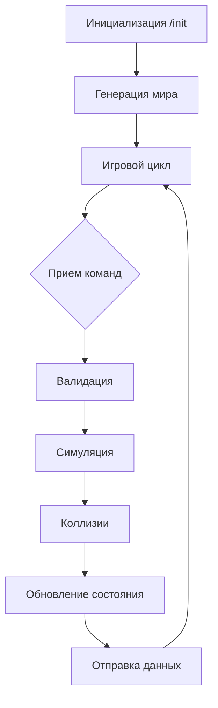

### Спецификация сервера для симуляции игры

#### Основные параметры
1. **Игровое поле**:
   - Размер: от 10x10 до 1000x1000 клеток
   - Фиксируется при инициализации сервера
   - Координаты: (0, 0) в левом верхнем углу

2. **Игровой цикл**:
   - Тик: 1-5 секунд (настраивается)
   - Поддержка сидов для детерминированной генерации

---

#### Сущности мира
| Тип         | Кол-во          | Свойства                     | Поведение                  |
|-------------|-----------------|------------------------------|----------------------------|
| **Агент**   | 1               | Позиция, радиус обзора, направление | Управляется клиентом       |
| **NPC**     | 0-1000          | Позиция, ID                  | Автономное/хаотичное движение |
| **Ресурсы** | 0-1000          | Позиция                      | Исчезают после сбора       |
| **Препятствия** | 0-30% поля   | Позиция                      | Статичны, блокируют движение |

---

#### Механики взаимодействия
1. **Перемещение**:
   - Разрешено только на свободные клетки
   - Клетка считается свободной, если:
     - Нет препятствий
     - Нет других сущностей (кроме ресурсов)
   - Ресурсы **не** блокируют движение

2. **Атака**:
   - Агент может атаковать NPC в радиусе обзора
   - NPC уничтожается одним попаданием

3. **Сбор ресурсов**:
   - Автоматически при нахождении агента в клетке с ресурсом
   - Ресурс исчезает, игроку начисляются очки

4. **Столкновение с препятствием**:
   - Агент мгновенно респавнится в случайной точке
   - Штраф: -10 очков за респавн

---

#### Данные для клиента
- **Состояние агента**:
  - Текущие очки (score)
  - Количество респавнов
- **Видимые сущности** (в радиусе обзора):
  - NPC (ID, позиция)
  - Ресурсы (позиция)
  - Препятствия (позиция)

---

### API Endpoints
#### 1. Инициализация игры
**Endpoint**: `POST /init`  
**Тело запроса**:
```json
{
  "field_size": 50,
  "tick_interval": 3,
  "seed": 12345,
  "npc_count": 100,
  "resource_count": 200,
  "obstacle_percent": 15,
  "enable_npc_movement": true,
  "agent_vision_radius": 5
}
```
**Ответ**: `HTTP 200 OK`  
**Ошибки**:
- `400`: Невалидные параметры
- `409`: Игра уже инициализирована

---

#### 2. Получение полного состояния (админ)
**Endpoint**: `GET /full-state`  
**Ответ**:
```json
{
  "agent": {"x": 10, "y": 5, "score": 42, "respawns": 2},
  "npcs": [{"id": 1, "x": 15, "y": 20}, ...],
  "resources": [{"x": 7, "y": 3}, ...],
  "obstacles": [{"x": 5, "y": 5}, ...]
}
```
**Ошибки**:
- `404`: Игра не инициализирована

---

#### 3. Отправка команд
**Endpoint**: `POST /command`  
**Тело запроса**:
```json
{
  "command": "move",
  "direction": "left"
}
```
**Возможные команды**:
- `move` (направления: up/down/left/right)
- `attack` (направления: up/down/left/right)

**Ответ**:
```json
{
  "status": "success",
  "visible_entities": {
    "npcs": [{"id": 1, "x": 12, "y": 5}],
    "resources": [{"x": 8, "y": 5}],
    "obstacles": []
  },
  "agent": {"x": 10, "y": 5, "score": 45, "respawns": 2}
}
```
**Ошибки**:
- `400`: Невалидная команда
- `403`: Игра не инициализирована
- `409`: Невозможно выполнить команду (блокировка пути)

---

### Алгоритм работы сервера
1. **Инициализация**:
   - Прием конфигурации
   - Генерация мира:
     ```python
     def generate_world():
         create_obstacles()  # 0-30% поля
         spawn_resources()    # 0-1000 единиц
         spawn_npcs()         # 0-1000 NPC
         spawn_agent()        # 1 агент
     ```

2. **Игровой цикл**:
   ```python
   while game_running:
       # Фаза 1: Прием команд
       process_client_commands()
       
       # Фаза 2: Симуляция
       move_npcs()           # Автономное движение
       handle_collisions()    # Обработка столкновений
       update_scores()        # Начисление очков
       
       # Фаза 3: Отправка состояния
       send_visible_entities()
       
       sleep(tick_interval)
   ```

3. **Обработка коллизий**:
   ```python
   def handle_collisions():
       if agent.position in resources:
           collect_resource(agent.position)
           
       if agent.position in obstacles:
           respawn_agent()
   ```

4. **Визуализация для бота**:
   ```python
   def get_visible_entities():
       return {
           "npcs": filter_in_radius(agent.position, npcs),
           "resources": filter_in_radius(agent.position, resources),
           "obstacles": filter_in_radius(agent.position, obstacles)
       }
   ```

---

### Обработка ошибок
| Код | Ситуация                          |
|-----|-----------------------------------|
| 400 | Невалидные параметры запроса      |
| 403 | Действие запрещено                |
| 404 | Ресурс не найден                  |
| 409 | Конфликт состояния (блокировка)   |
| 418 | Технические работы | Я чайник     |
| 500 | Внутренняя ошибка сервера         |

---

### Требования к производительности
1. Оптимизация для больших полей (1000x1000):
   - Пространственное индексирование сущностей
   - QuadTree для поиска в радиусе обзора
2. Потокобезопасность:
   - Блокировки ресурсов при обработке команд
   - Асинхронная обработка тиков

